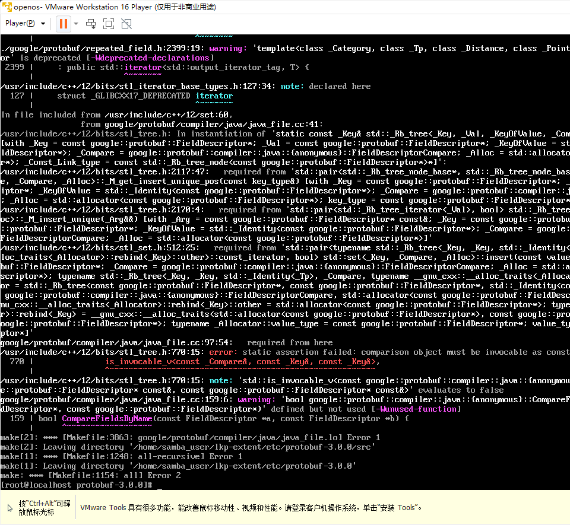

# OpenCloudOS

## 1. lkp 基础环境
- **版本**：OpenCloudOS 8.6
- **虚拟化工具**：VMware

## 2. 遇到的问题及解决办法

### 2.1. 系统使用问题
- **问题描述**：OpenCloudOS 命令行无法复制报错及粘贴指令。
- **初步解决思路**：考虑使用 ssh 访问虚拟机。
- **最终解决方案**：
  - 使用图形化的 OpenCloudOS 8.6，实现鼠标复制粘贴。
  - 使用 xshell&xftp 访问 OpenCloudOS 虚拟机，方便复制、粘贴与文件传输。

### 2.2. git 链接无法下载
- **初步解决思路**：
  - 通过 samba 共享文件夹，先在 Windows 下通过代理下载，再传至 Linux。
  - 在 Linux 下安装代理。
- **解决过程**：
  - 参考 OpenCloudOS 官方文档，学习并配置 samba。
  - 发现一些与 OpenCloudOS 9 的指令不兼容，按照适用于 OpenCloudOS 的指令进行调整。
  - [提交修正 PR 到 OpenCloudOS 文档](https://gitee.com/OpenCloudOS/Document/pulls/46)。
  - **注意**：OpenCloudOS 9.0 下只支持 `useradd`，而 8.6 版本支持 `adduser` 和 `useradd`。
- **更好的解决过程**：
  - 主机打开代理，虚拟机连接到打开代理的端口，即可将主机的网络代理传递给虚拟机使用，解决了git clone等指令无法下载的问题。

### 2.3. protobuf 安装问题
- **问题描述**：安装 protobuf 时，`make` 过程报错。

- **解决方案**：使用8.6版本替换之前使用的opencloudos9.0版本，该兼容性问题就不会再遇到了，后续在部署在opencloudos9的时候需要考虑对这个问题进行修复。

### 2.4. `build.sh` 执行问题
- **问题描述**：执行 `build.sh` 报行尾字符错误。
- **解决方案**：
使用 `dos2unix` 工具将脚本文件从CRLF格式转换为LF格式。

可以使用以下命令进行安装：

```bash
sudo yum install dos2unix
```

然后，使用 `dos2unix` 转换 `build.sh` 文件：

```bash
dos2unix build.sh
```

这将移除脚本中的Carriage Return字符。之后，能够正常执行 `./build.sh` 脚本了。


使用样例：
``` shell
[root@localhost lkp-extent]# lkp-ctl list
/home/user/lkp/lkp-extent/sbin/list:行2: $'\r': 未找到命令
/home/user/lkp/lkp-extent/sbin/list:行4: $'\r': 未找到命令
/home/user/lkp/lkp-extent/sbin/list:行5: 未预期的符号 `$'{\r'' 附近有语法错误
'home/user/lkp/lkp-extent/sbin/list:行5: `usage() {
[root@localhost lkp-extent]# ls /home/user/lkp/lkp-extent/sbin
init  list  push  result  run  start  stop  update

find /home/user/lkp/lkp-extent/sbin/ -type f | xargs dos2unix
```

### 2.5. 优化 Docker 启动流程
- **问题描述**：多 Docker 环境下选择并启动 Docker 过程繁琐。
- **解决方案**：编写脚本简化 Docker 启动流程。
```shell

containers=($(docker ps -aq))

docker ps -a

echo "Please enter the number of the container you want to start and attach to (e.g.: 1, 2, ...):"

read choice
container_id=${containers[$choice-1]}

docker start $container_id
docker attach $container_id

```
### 2.6. 客户机（基于docker）的opencloudOS8.6环境依赖安装
- **软件安装清单**：
  ```
  yum install gzip tar make unzip gcc gcc-c++ git cmake boost-devel zlib-devel
  ```
- **安装好之后输入如下指令**：
  ```
  git clone https://github.com/OpenCloudOS/lkp-tests.git
  git clone https://github.com/OpenCloudOS/lkp-extent.git
  ```

### 2.7. 下载方式的区别
- **git clone**：带有 `.git` 文件夹，包含版本信息，支持更新和版本回退。
- **zip**：需要解压，无法更新和版本回退。
